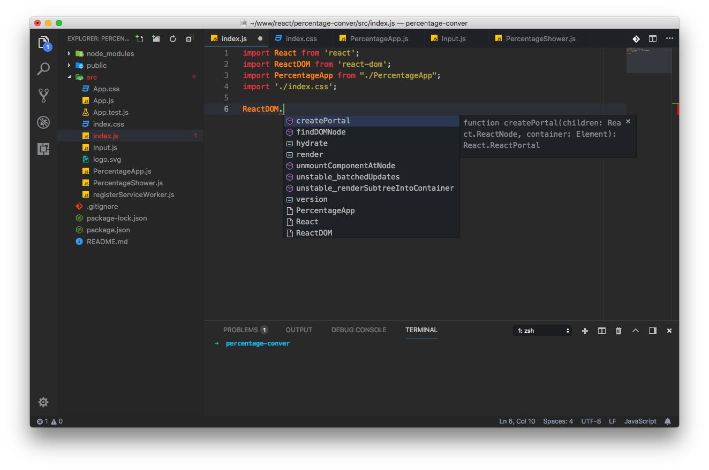

<p align="center">
	<a href="https://code.visualstudio.com">
		
	</a>
</p>

当前版本：`v1.22.2`

最终效果预览



> PS：预览图中的最终效果，基于图标主题 **Material Icon Theme** 和 颜色主题 **One Monokai Theme** 定制，详见[自定义配置](./settings.json)。

### 替代图标

[点击这里预览](./icons/README.md)

### 第三方插件


> **安装方式**
> 
> `Cmd + p` 输入 `ext install [插件名或关键字]` 回车，根据搜索到的插件列表，查找需要的插件，点击 `Install` 之后重启。

**以下是一些推荐的插件及基本配置，详细说明及配置项参加各插件文档。**

#### Paste and Indent

> 带格式的粘贴

设置：

1. 修改文件 keybindings.json，追加以下设置（ctrl+v 带格式；ctrl+shift+v 原样）

	```json
	[
	    {
	        "key": "cmd+v",
	        "command": "pasteAndIndent.action",
	        "when": "editorTextFocus && !editorReadonly"
	    },
	    {
	        "key": "cmd+v",
	        "command": "editor.action.clipboardPasteAction",
	        "when": "!editorTextFocus"
	    },
	    {
	        "key": "cmd+shift+v",
	        "command": "editor.action.clipboardPasteAction",
	        "when": "editorTextFocus && !editorReadonly"
	    }
	]
	```

2. 修改用户配置 Preferences > Settings，追加如下设置

	```json
	"pasteAndIndent.selectAfter": true,
	```

#### PHP IntelliSense

> PHP 语法检查、提示加强等

添加用户设置：

```json
"php.executablePath": "/usr/bin/php",
"php.validate.run": "onType",
"php.suggest.basic": false,
```

#### PHP Debug

> PHP 断点调试，详细配置[单击这里](./php_xdebug.md)

#### PHP DocBlocker

> PHP 快速注释工具

#### Bracket Pair Colorizer

> 括号高亮
 
添加用户设置：

```json
"editor.matchBrackets": false,
"bracketPairColorizer.highlightActiveScope": true,
"bracketPairColorizer.showBracketsInGutter": true,
"bracketPairColorizer.showVerticalScopeLine": false,
"bracketPairColorizer.activeScopeCSS": [
    "borderStyle : none",
    "backgroundColor : {color}; opacity: 0.5"
],
```

#### Insert Date String

> 插入日期时间

添加用户设置：

```json
// 插入日期时间 command + shift + i
//  DDDD, MMMM D, YYYY A HH:mm:ss -> Tuesday, April 3, 2018 PM 02:35:08
"insertDateString.format": "YYYY/MM/DD hh:mm:ss"
```

#### ESLint

> js 语法检查

添加用户设置：

```json
"javascript.validate.enable" : false,
"eslint.autoFixOnSave": true, // 保存时修复
// "eslint.trace.server": "messages",// 输出 ESLint 执行时的 log，ESLint 不生效的时候可以启用看看
"eslint.validate": [ // 配置检查的文件类型
    "javascript",
    "javascriptreact",
    "html"
],
```

如下设置

1. 安装插件、重启；
2. 输入命令 `npm install -g eslint` 全局安装 `eslint` ；
3. 安装对应语言的规则，如 react 的

	```
	npm install --save-dev eslint-config-alloy eslint-plugin-react babel-eslint
	```
	
	其中：
	
	- `eslint-config-alloy` AlloyTeam 出的通用基础语法
	- `eslint-plugin-react` react 相关语法
	- `babel-eslint` es2015 语法
4. 在项目更目录下添加 `.eslintrc.js` 文件，并追加以下内容：

	```javascript
	module.exports = {
	    extends: [
	        'eslint-config-alloy/react',
	    ],
	    globals: {
	        // 这里填入你的项目需要的全局变量
	        // 这里值为 false 表示这个全局变量不允许被重新赋值，比如：
	        //
	        // React: false,
	        // ReactDOM: false
	    },
	    rules: {
	        // 这里填入你的项目需要的个性化配置，比如：
	        //
	        // // @fixable 一个缩进必须用两个空格替代
	        // 'indent': [
	        //     'error',
	        //     2,
	        //     {
	        //         SwitchCase: 1,
	        //         flatTernaryExpressions: true
	        //     }
	        // ],
	        // // @fixable jsx 的 children 缩进必须为两个空格
	        // 'react/jsx-indent': [
	        //     'error',
	        //     2
	        // ],
	        // // @fixable jsx 的 props 缩进必须为两个空格
	        // 'react/jsx-indent-props': [
	        //     'error',
	        //     2
	        // ]
	    }
	};
	```
	
以上配置参照自 [AlloyTeam ESLint 配置指南](http://www.alloyteam.com/2017/08/13065/)
